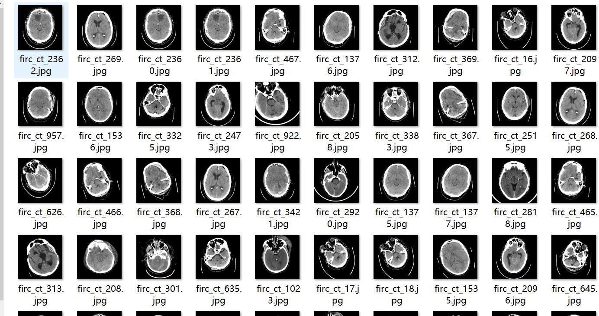
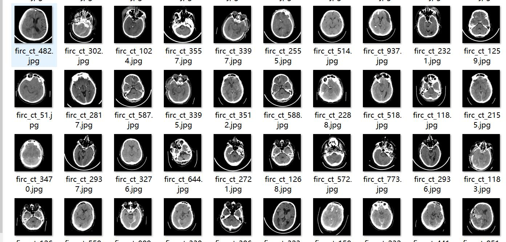
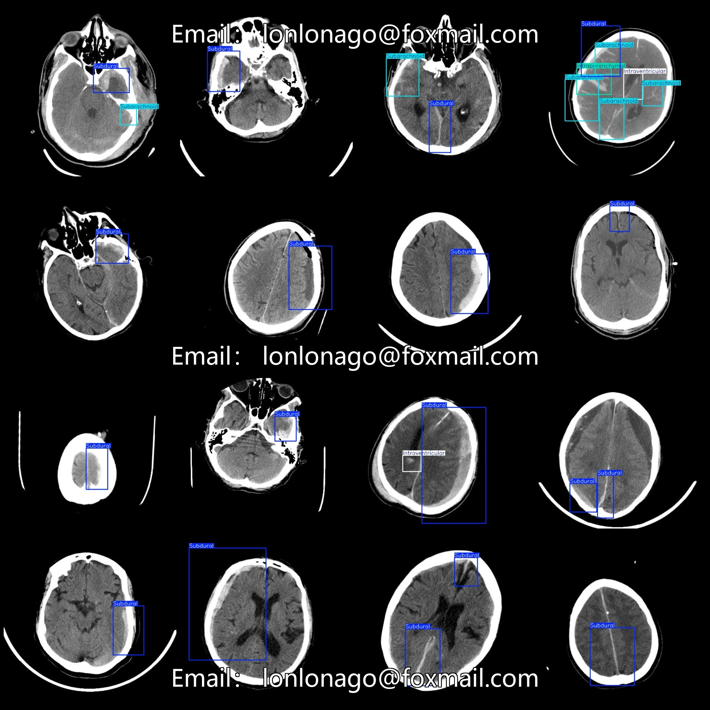

# CT Image Volumes of Cerebral Hemorrhage Detection Dataset with VOC+YOLO Format and 3568 Images in 4 Categories

Dataset format: Pascal VOC format + YOLO format (txt file without split path, only containing jpg images and corresponding VOC format xml files and yolo format txt files)

Number of images (jpg files): 3568 
Number of annotations (xml files): 3568 
Number of annotations (txt files): 3568 
Number of annotation categories: 4 
Repository: firc-dataset 
Annotation category names (note that the order of categories in the yolo format is not consistent with this, but is based on the labels folder's classes.txt): ["Intraparenchymal", "Intraventricular", "Subarachnoid", "Subdural"]

Each category has a number of bounding boxes:
- Intraparenchymal (blood vessel bleeding within the brain parenchyma) = 655
- Intraventricular (blood vessel bleeding within the ventricles) = 141
- Subarachnoid (blood vessel bleeding beneath the arachnoid mater) = 579
- Subdural (blood vessel bleeding beneath the dura mater) = 4156
Total bounding box count: 5531

Image resolution: 640x640 
Images exist with enhancement: about 1/3 are original images, the rest are enhanced images 

Annotation tool used: labelImg 
Annotation rules: draw bounding boxes for each category 

Important notes: No specific statements are currently made regarding accuracy guarantees for models trained on this dataset or weights files.

Image preview:

Annotation example:
## Images

Here is a pay link on Stripe ( https://buy.stripe.com/3cs8yP7sY87d0vu9AB ). Please contact me lonlonago@foxmail.com after funding $89, and I will send you a complete data files , thank you!

